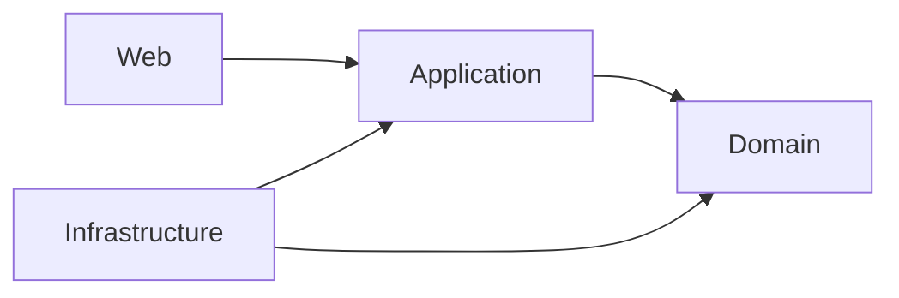

# Cinema

Cinema là dự án cá nhân xây theo Clean Architecture. Đã hoàn thiện **M0 — nền kiến trúc** và **M1 — Cinema / Hall / Seat**; các chức năng bán vé thuộc những milestone tiếp theo.

## Kiến trúc và tài liệu



- [Tổng quan kiến trúc và domain](docs/architecture-contract.md): bản tổng quan, luật nghiệp vụ, workflow, model, ports và cấu trúc source.
- [Lược đồ quan hệ](docs/relational-schema.md): ERD, bảng, khóa, constraint, chỉ mục và transaction.
- [Kế hoạch Cinema V1](docs/cinema-v1-plan.md): kế hoạch đã thống nhất, phạm vi V1 và các nâng cấp Phase 2.
- [Tiến độ Cinema V1](docs/cinema-v1-progress.md): checklist M0–M12, bước tiếp theo và nhật ký thực hiện.
- [Quy trình dự án cá nhân](docs/team-work-allocation.md): thứ tự triển khai và điều kiện hoàn thành từng milestone.
- [Nghiệm thu M1](docs/m1-acceptance.md): phạm vi và ma trận kiểm chứng Cinema/Hall/Seat.

## Chạy và kiểm tra

Đặc tả M1: [M1 — Cinema / Hall / Seat](docs/m1-specification.md).
M1 đã có luồng tạo và truy vấn rạp/phòng/ghế qua Application và HTTP.

Dùng JDK 17 theo `pom.xml`. Dự án đã có Maven Wrapper:

```powershell
.\mvnw.cmd clean verify
.\mvnw.cmd spring-boot:run
```

Nếu Maven trỏ cache vào `C:\.m2` và không ghi được, truyền `-Dmaven.repo.local` với đường dẫn cache có quyền truy cập.

## Trạng thái triển khai

Ứng dụng khởi động được mà chưa cần database, Redis hay RabbitMQ. Profile mặc định vẫn chặn toàn bộ request; JWT filter chưa đăng ký, chưa có tài khoản mặc định hay thanh toán hoạt động.

M1 có request/response, xử lý JSON lỗi, controller, Application handler và
repository in-memory. Profile `venue-dev` chỉ cho phép method/path được định
nghĩa trong đặc tả M1; dữ liệu mất khi ứng dụng khởi động lại.

Ví dụ HTTP đầy đủ nằm tại [docs/m1-venue-demo.http](docs/m1-venue-demo.http).

Chạy cấu hình phát triển M1 khi cần kiểm tra profile:

```powershell
.\mvnw.cmd spring-boot:run '-Dspring-boot.run.profiles=venue-dev'
```

M1 dùng lưu trữ in-memory, mất dữ liệu khi khởi động lại; chưa có JPA migration,
sửa/xóa địa điểm, tạo ghế hàng loạt, Screening hay phân quyền ADMIN thật.

Các handler của những milestone chưa triển khai vẫn ném `FeatureNotImplementedException`. `BaseEntity` từ chối ID null/blank; `Money` từ chối amount/currency null và số tiền âm. JPA entity mới có ID, phần mapping còn phải làm tiếp.

Test đang chạy kiểm tra luật nền tảng, dependency, khởi động/security và việc handler báo chưa implement. M0 có 13 domain test và 6 architecture test đạt, không bỏ qua. `BookingWorkflowTest` còn 8 test skeleton bị `@Disabled`, thuộc các bước triển khai sau.

Source cũ và SQL migration cũ đã được thay bằng skeleton; database bên ngoài không bị thay đổi trong bước dựng lại đó.
