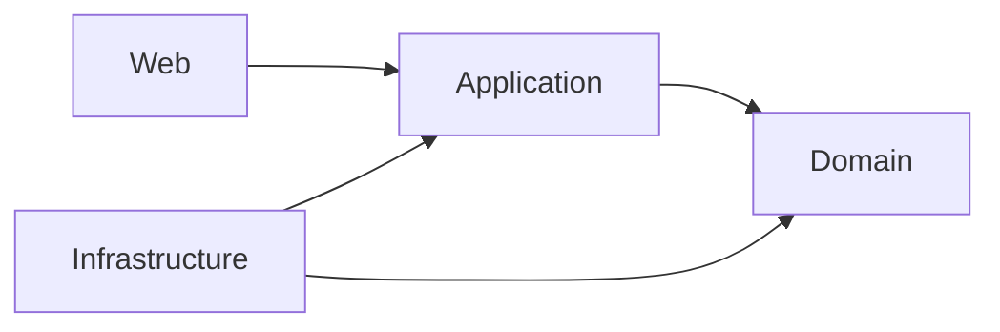

# Cinema

Cinema được xây lại theo Clean Architecture. Đã hoàn thiện **M0 — nền kiến trúc**, gồm kiểm tra dữ liệu của `Money`, `BaseEntity` và kiểm thử nền tảng; các chức năng bán vé vẫn ở mức skeleton.

## Kiến trúc và tài liệu



- [Tổng quan kiến trúc và domain](docs/architecture-contract.md): bản tổng quan, luật nghiệp vụ, workflow, model, ports và cấu trúc source.
- [Lược đồ quan hệ](docs/relational-schema.md): ERD, bảng, khóa, constraint, chỉ mục và transaction.
- [Kế hoạch Cinema V1](docs/cinema-v1-plan.md): kế hoạch đã thống nhất, phạm vi V1 và các nâng cấp Phase 2.
- [Tiến độ Cinema V1](docs/cinema-v1-progress.md): checklist M0–M12, bước tiếp theo và nhật ký thực hiện.
- [Phân công công việc](docs/team-work-allocation.md): phần việc của từng thành viên trong 18 mốc, điều kiện chuyển mốc và quy trình review/ghép vào main.

## Chạy và kiểm tra

Đặc tả bước tiếp theo: [M1 — Cinema / Hall / Seat](docs/m1-specification.md),
kèm bốn bản giao việc theo thành viên. M1 đang triển khai phần Web độc lập,
chưa hoàn thành luồng tạo rạp/phòng/ghế.

Dùng JDK 25. Dự án đã có Maven Wrapper:

```powershell
.\mvnw.cmd clean verify
.\mvnw.cmd spring-boot:run
```

Nếu Maven trỏ cache vào `C:\.m2` và không ghi được, truyền `-Dmaven.repo.local` với đường dẫn cache có quyền truy cập.

## Trạng thái triển khai

Ứng dụng khởi động được mà chưa cần database, Redis hay RabbitMQ. Controller chưa có endpoint nghiệp vụ; profile mặc định vẫn chặn toàn bộ request. JWT filter chưa đăng ký, chưa có tài khoản mặc định hay thanh toán hoạt động.

Phần Web M1 đã có request/response, xử lý JSON lỗi và security profile `venue-dev`.
Profile này chỉ cho phép method/path được định nghĩa trong đặc tả M1; chưa có
controller/handler/repository để thực hiện chức năng tạo rạp/phòng/ghế.
Các request/response được kiểm thử qua controller thử nghiệm trong test,
không có controller giả trong source ứng dụng.

Chạy cấu hình phát triển M1 khi cần kiểm tra profile:

```powershell
.\mvnw.cmd spring-boot:run '-Dspring-boot.run.profiles=venue-dev'
```

M1 sẽ dùng lưu trữ in-memory, mất dữ liệu khi khởi động lại.
Chờ bàn giao Domain/Application và adapter để kiểm thử nghiệp vụ toàn luồng.

Handler chưa implement sẽ ném `FeatureNotImplementedException`. Domain method và adapter chưa implement sẽ ném `UnsupportedOperationException`. `BaseEntity` từ chối ID null/blank; `Money` từ chối amount/currency null và số tiền âm. Các invariant nghiệp vụ khác còn phải triển khai theo milestone. JPA entity mới có ID, phần mapping còn phải làm tiếp.

Test đang chạy kiểm tra luật nền tảng, dependency, khởi động/security và việc handler báo chưa implement. M0 có 13 domain test và 6 architecture test đạt, không bỏ qua. `BookingWorkflowTest` còn 8 test skeleton bị `@Disabled`, thuộc các bước triển khai sau.

Source cũ và SQL migration cũ đã được thay bằng skeleton; database bên ngoài không bị thay đổi trong bước dựng lại đó.
