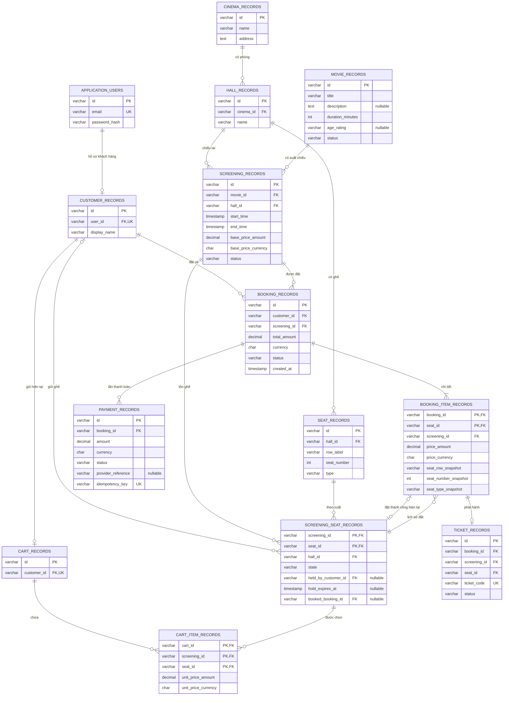

# Lược đồ quan hệ Cinema

## 1. Phạm vi và quy ước

Đây là **thiết kế quan hệ đề xuất để triển khai**, dựa trên domain trong `src/main/java/cinema/domain`, `ApplicationUser` và [Tổng quan kiến trúc và domain](architecture-contract.md). Hiện các JPA entity chỉ có `id`, JPA auto-configuration đang tắt; tài liệu này không mô tả một database đã được tạo hoặc migration đã chạy.

Thiết kế gồm **14 bảng**, giữ tên `*_records` của các JPA entity hiện có. Các bảng Identity, Cinema, Hall, CartItem, BookingItem và ScreeningSeat được bổ sung để hoàn thiện persistence. Không thêm chức năng ngoài phạm vi hiện tại như đồ ăn, khuyến mãi hay đánh giá phim.

- `PK`: khóa chính; `FK`: khóa ngoại; `UK`: khóa duy nhất. Khóa ghép gồm toàn bộ các cột được liệt kê cùng nhau.
- ID dùng `VARCHAR(64)` tương ứng Java `String`; độ dài là đề xuất, ứng dụng sinh ID. Không giả định ID hiện tại bắt buộc là UUID.
- Tiền dùng `DECIMAL(19,4)` và mã tiền tệ `CHAR(3)`, ánh xạ từ `Money`. Không dùng số thực để lưu tiền.
- Thời gian dùng kiểu timestamp có múi giờ của hệ quản trị được chọn, lưu thời điểm UTC, ánh xạ `Instant`.
- Mọi cột mặc định `NOT NULL`, trừ cột có dấu `?`. Enum lưu chuỗi và có `CHECK` theo mục 5.
- Một khách có tối đa một giỏ hiện tại; một booking có thể có nhiều lần thử thanh toán. Đây là lựa chọn thiết kế persistence cho các quan hệ chưa được domain giới hạn rõ.

## 2. Sơ đồ ERD

Các cạnh thể hiện quan hệ logic. Khóa ngoại ghép và ràng buộc điều kiện được diễn giải ở mục 4–6; riêng các cột PK/FK ghép không được hiểu là duy nhất khi đứng riêng.

Quan hệ `Booking → BookingItem` là `1..N` theo nghiệp vụ; FK đơn thuần chỉ bảo đảm chiều item → booking. Quan hệ ghế → nhiều booking item là lịch sử: nhiều booking đã hủy có thể cùng tham chiếu một ghế của một suất, nhưng chỉ một booking được chiếm ghế tại một thời điểm.

## 3. Các quan hệ và thuộc tính

Ký hiệu `?` chỉ cột cho phép `NULL`. Độ dài chuỗi ngoài ID là đề xuất triển khai.

### `application_users`

Thuộc tính:

- `id VARCHAR(64)`
- `email VARCHAR(254)`
- `password_hash VARCHAR(255)`

Khóa và ràng buộc:

- PK `id`
- UK `email` sau chuẩn hóa

### `customer_records`

Thuộc tính:

- `id VARCHAR(64)`
- `user_id VARCHAR(64)`
- `display_name VARCHAR(255)`

Khóa và ràng buộc:

- PK `id`
- UK `user_id`

### `cinema_records`

Thuộc tính:

- `id VARCHAR(64)`
- `name VARCHAR(255)`
- `address TEXT`

Khóa và ràng buộc:

- PK `id`

### `hall_records`

Thuộc tính:

- `id VARCHAR(64)`
- `cinema_id VARCHAR(64)`
- `name VARCHAR(255)`

Khóa và ràng buộc:

- PK `id`
- UK `(cinema_id, name)` đề xuất

### `seat_records`

Thuộc tính:

- `id VARCHAR(64)`
- `hall_id VARCHAR(64)`
- `row_label VARCHAR(20)`
- `seat_number INTEGER`
- `type VARCHAR(20)`

Khóa và ràng buộc:

- PK `id`
- UK `(hall_id, row_label, seat_number)`
- UK `(id, hall_id)` phục vụ FK ghép

### `movie_records`

Thuộc tính:

- `id VARCHAR(64)`
- `title VARCHAR(255)`
- `description TEXT?`
- `duration_minutes INTEGER`
- `age_rating VARCHAR(20)?`
- `status VARCHAR(20)`

Khóa và ràng buộc:

- PK `id`

### `screening_records`

Thuộc tính:

- `id VARCHAR(64)`
- `movie_id VARCHAR(64)`
- `hall_id VARCHAR(64)`
- `start_time TIMESTAMP_TZ`
- `end_time TIMESTAMP_TZ`
- `base_price_amount DECIMAL(19,4)`
- `base_price_currency CHAR(3)`
- `status VARCHAR(20)`

Khóa và ràng buộc:

- PK `id`
- UK `(id, hall_id)` phục vụ FK ghép

### `screening_seat_records`

Thuộc tính:

- `screening_id VARCHAR(64)`
- `seat_id VARCHAR(64)`
- `hall_id VARCHAR(64)`
- `state VARCHAR(20)`
- `held_by_customer_id VARCHAR(64)?`
- `hold_expires_at TIMESTAMP_TZ?`
- `booked_booking_id VARCHAR(64)?`

Khóa và ràng buộc:

- PK `(screening_id, seat_id)`

### `cart_records`

Thuộc tính:

- `id VARCHAR(64)`
- `customer_id VARCHAR(64)`

Khóa và ràng buộc:

- PK `id`
- UK `customer_id`

### `cart_item_records`

Thuộc tính:

- `cart_id VARCHAR(64)`
- `screening_id VARCHAR(64)`
- `seat_id VARCHAR(64)`
- `unit_price_amount DECIMAL(19,4)`
- `unit_price_currency CHAR(3)`

Khóa và ràng buộc:

- PK `(cart_id, screening_id, seat_id)`

### `booking_records`

Thuộc tính:

- `id VARCHAR(64)`
- `customer_id VARCHAR(64)`
- `screening_id VARCHAR(64)`
- `total_amount DECIMAL(19,4)`
- `currency CHAR(3)`
- `status VARCHAR(20)`
- `created_at TIMESTAMP_TZ`

Khóa và ràng buộc:

- PK `id`
- UK `(id, screening_id)` phục vụ FK ghép

### `booking_item_records`

Thuộc tính:

- `booking_id VARCHAR(64)`
- `seat_id VARCHAR(64)`
- `screening_id VARCHAR(64)`
- `price_amount DECIMAL(19,4)`
- `price_currency CHAR(3)`
- `seat_row_snapshot VARCHAR(20)`
- `seat_number_snapshot INTEGER`
- `seat_type_snapshot VARCHAR(20)`

Khóa và ràng buộc:

- PK `(booking_id, seat_id)`
- UK `(booking_id, screening_id, seat_id)` phục vụ FK ghép

### `payment_records`

Thuộc tính:

- `id VARCHAR(64)`
- `booking_id VARCHAR(64)`
- `amount DECIMAL(19,4)`
- `currency CHAR(3)`
- `status VARCHAR(20)`
- `provider_reference VARCHAR(255)?`
- `idempotency_key VARCHAR(128)`

Khóa và ràng buộc:

- PK `id`
- UK `idempotency_key`
- tối đa một lần `SUCCESS` mỗi booking

### `ticket_records`

Thuộc tính:

- `id VARCHAR(64)`
- `booking_id VARCHAR(64)`
- `screening_id VARCHAR(64)`
- `seat_id VARCHAR(64)`
- `ticket_code VARCHAR(128)`
- `status VARCHAR(20)`

Khóa và ràng buộc:

- PK `id`
- UK `ticket_code`
- UK `(booking_id, seat_id)`

`TIMESTAMP_TZ` là ký hiệu kiểu logic, không phải SQL chạy trực tiếp. Chọn kiểu tương ứng khi chốt hệ quản trị database.

Các cột snapshot ghế, `payment_records.idempotency_key` và toàn bộ `screening_seat_records` là phần bổ sung đề xuất. Domain `BookingItem` hiện chỉ có `seatId`, `price`; snapshot nhãn/số/loại ghế giúp lịch sử không đổi khi sơ đồ ghế được chỉnh sửa. `screening_id` trong booking item là cột bổ sung để ràng buộc tính nhất quán bằng FK ghép.

Không tạo bảng riêng cho `Money`, enum hoặc `BaseEntity`: `Money` được nhúng thành hai cột, enum thành chuỗi, và ID nằm tại từng bảng. `CartItem` và `BookingItem` không cần ID nhân tạo vì đã có khóa ghép tự nhiên.

## 4. Danh sách khóa ngoại đầy đủ

- Cột nguồn: `customer_records(user_id)`
  Tham chiếu: `application_users(id)`

- Cột nguồn: `hall_records(cinema_id)`
  Tham chiếu: `cinema_records(id)`

- Cột nguồn: `seat_records(hall_id)`
  Tham chiếu: `hall_records(id)`

- Cột nguồn: `screening_records(movie_id)`
  Tham chiếu: `movie_records(id)`

- Cột nguồn: `screening_records(hall_id)`
  Tham chiếu: `hall_records(id)`

- Cột nguồn: `screening_seat_records(screening_id, hall_id)`
  Tham chiếu: `screening_records(id, hall_id)`

- Cột nguồn: `screening_seat_records(seat_id, hall_id)`
  Tham chiếu: `seat_records(id, hall_id)`

- Cột nguồn: `screening_seat_records(held_by_customer_id)`
  Tham chiếu: `customer_records(id)`

- Cột nguồn: `screening_seat_records(booked_booking_id, screening_id, seat_id)`
  Tham chiếu: `booking_item_records(booking_id, screening_id, seat_id)`

- Cột nguồn: `cart_records(customer_id)`
  Tham chiếu: `customer_records(id)`

- Cột nguồn: `cart_item_records(cart_id)`
  Tham chiếu: `cart_records(id)`

- Cột nguồn: `cart_item_records(screening_id, seat_id)`
  Tham chiếu: `screening_seat_records(screening_id, seat_id)`

- Cột nguồn: `booking_records(customer_id)`
  Tham chiếu: `customer_records(id)`

- Cột nguồn: `booking_records(screening_id)`
  Tham chiếu: `screening_records(id)`

- Cột nguồn: `booking_item_records(booking_id, screening_id)`
  Tham chiếu: `booking_records(id, screening_id)`

- Cột nguồn: `booking_item_records(screening_id, seat_id)`
  Tham chiếu: `screening_seat_records(screening_id, seat_id)`

- Cột nguồn: `payment_records(booking_id)`
  Tham chiếu: `booking_records(id)`

- Cột nguồn: `ticket_records(booking_id, screening_id, seat_id)`
  Tham chiếu: `booking_item_records(booking_id, screening_id, seat_id)`

Hai FK ghép qua `hall_id` bảo đảm ghế và suất chiếu cùng phòng. FK ghép booking item bảo đảm mọi item cùng suất với booking. FK của ticket bảo đảm vé tham chiếu đúng một item, đúng ghế và đúng suất.

FK của `booked_booking_id` dùng ngữ nghĩa cho phép bỏ kiểm tra khi thành phần nullable là `NULL` (thường gọi là `MATCH SIMPLE`). Khi trạng thái `BOOKED`, cột này bắt buộc có giá trị và toàn bộ khóa ghép phải khớp một booking item.

Vì có vòng tham chiếu giữa tồn ghế và booking item, tạo hai bảng trước rồi thêm FK `booked_booking_id` bằng `ALTER TABLE` trong migration. Khi ghi dữ liệu: tạo tồn ghế `AVAILABLE` trước, tạo booking/item sau, cuối cùng cập nhật tồn ghế thành `BOOKED`.

Chính sách xóa đề xuất: chỉ `cart_records → cart_item_records` dùng `ON DELETE CASCADE`. Các FK khác dùng `RESTRICT`/`NO ACTION`; không xóa dây chuyền lịch sử thanh toán, booking, vé. Hủy nghiệp vụ dùng trạng thái; không sửa ID khóa chính.

## 5. Miền giá trị và ràng buộc

### `movie_records.status`

`COMING_SOON`, `SHOWING`, `ARCHIVED`

### `screening_records.status`

`SCHEDULED`, `CANCELLED`, `COMPLETED`

### `seat_records.type`, `seat_type_snapshot`

`NORMAL`, `VIP`, `COUPLE`

### `booking_records.status`

`PENDING`, `CONFIRMED`, `CANCELLED`

### `payment_records.status`

`PENDING`, `SUCCESS`, `FAILED`, `REFUNDED`

### `ticket_records.status`

`VALID`, `USED`, `CANCELLED`

### `screening_seat_records.state`

`AVAILABLE`, `HELD`, `BOOKED` — enum persistence đề xuất

### Các cột tiền

`>= 0`; currency gồm ba chữ cái viết hoa, được application kiểm tra là mã tiền tệ hợp lệ

### `duration_minutes`, `seat_number`, `seat_number_snapshot`

`> 0`

### `start_time`, `end_time`

`start_time < end_time`

### ID, tên, title, row label, ticket code, idempotency key

Không rỗng sau khi bỏ khoảng trắng

Email được chuẩn hóa theo một policy thống nhất trước khi lưu/tra cứu để uniqueness không bị khác biệt chữ hoa/thường. Chỉ lưu hash mật khẩu; không lưu mật khẩu gốc.

Ràng buộc `CHECK` cho tồn ghế phải dùng kiểm tra `IS NULL`/`IS NOT NULL` tường minh:

### Trạng thái `AVAILABLE`

- `held_by_customer_id`: NULL
- `hold_expires_at`: NULL
- `booked_booking_id`: NULL

### Trạng thái `HELD`

- `held_by_customer_id`: Có giá trị
- `hold_expires_at`: Có giá trị
- `booked_booking_id`: NULL

### Trạng thái `BOOKED`

- `held_by_customer_id`: NULL
- `hold_expires_at`: NULL
- `booked_booking_id`: Có giá trị

Không dùng `CHECK(hold_expires_at > now())`: hold hợp lệ hôm nay sẽ hết hạn theo thời gian. Application kiểm tra hạn bằng `Clock` và cập nhật bản ghi trong transaction.

Ràng buộc thanh toán thành công: unique có điều kiện trên `payment_records(booking_id)` khi `status = 'SUCCESS'`. Nếu hệ quản trị không hỗ trợ unique có điều kiện, cần chiến lược tương đương và khóa booking trong transaction. Policy refund vẫn phải ngăn booking đã xác nhận bị thanh toán lại; unique này riêng lẻ không thực hiện toàn bộ state machine.

Không đặt UK toàn cục `(screening_id, seat_id)` trên cart item hoặc booking item: giỏ có thể còn item hết hạn, booking có thể đã hủy. PK của tồn ghế là nơi quản lý quyền chiếm ghế hiện tại. Không đặt UK riêng `booking_id` trên payment vì sẽ chặn lưu nhiều lần thử thanh toán.

## 6. Ràng buộc liên bảng và transaction

Các yêu cầu sau cần application kết hợp transaction/locking hoặc trigger thích hợp; không được coi là đã được FK và CHECK ở trên tự động bảo đảm.

1. **Lịch chiếu:** không trùng khoảng thời gian trong cùng phòng đối với các suất chưa hủy. Dùng khoảng nửa mở `[start_time, end_time)` để cho phép hai suất liền nhau. Khi tạo/sửa suất, khóa bản ghi phòng rồi kiểm tra overlap trong cùng transaction, hoặc dùng constraint khoảng thời gian nếu database hỗ trợ.
2. **Khởi tạo tồn ghế:** tạo một bản ghi `screening_seat_records` cho mỗi ghế bán được của suất chiếu. Giữ nguyên tham chiếu lịch sử khi sơ đồ phòng thay đổi. Ghế vật lý không mang trạng thái đặt/giữ.
3. **Giữ ghế:** khóa dòng tồn ghế hoặc cập nhật có điều kiện nguyên tử; chỉ chuyển `AVAILABLE` hoặc `HELD` đã hết hạn sang `HELD`. Không chuyển `BOOKED`. Lưu cart item và hold trong cùng transaction nếu dùng chung database. Thời hạn hold là cấu hình cần chốt, không mặc định là một giá trị đã có trong code.
4. **Giỏ hàng:** có thể chứa nhiều suất. Item trong giỏ không phải bằng chứng còn giữ ghế; phải kiểm tra khách sở hữu hold và `hold_expires_at` khi hiển thị khả dụng/checkout. Các item khác currency phải được nhóm theo currency khi tính tổng, hoặc bị từ chối theo policy; không cộng trực tiếp các tiền tệ khác nhau.
5. **Checkout:** nhóm theo suất để tạo các booking `PENDING`; mỗi booking có ít nhất một item. Copy giá và snapshot ghế, kiểm tra cùng currency, tính `total_amount = SUM(price_amount)`. Tạo booking/item và clear cart trong cùng transaction. Hold thuộc customer, không FK tới cart item, nên việc clear giỏ không làm mất hold.
6. **Trong lúc chờ thanh toán:** phải bảo vệ quyền giữ ghế của booking pending. Thiết kế hiện tại giữ hold theo customer như port hiện có; handler phải từ chối dùng cùng cặp suất–ghế cho hai booking pending đang hoạt động của khách. Cần chốt deadline booking và policy gia hạn hold trước khi triển khai payment thật.
7. **Thanh toán:** khóa booking để kiểm tra ownership, trạng thái `PENDING`, số tiền/currency và chống xử lý lặp. `idempotency_key` được sinh trước khi gọi gateway và được dùng lại khi retry cùng lần thanh toán. Các lần thử mới có key mới. Không giữ transaction database mở trong suốt một lời gọi mạng dài; cần trạng thái xử lý và đối soát kết quả gateway.
8. **Xác nhận:** trong một transaction, kiểm tra lại hold còn hợp lệ/thuộc khách, ghi payment `SUCCESS`, confirm booking, cập nhật từng dòng tồn ghế thành `BOOKED` với `booked_booking_id` tương ứng và phát hành đúng một ticket cho mỗi item. Khóa các dòng ghế theo thứ tự ổn định để giảm deadlock. Khi đổi sang `BOOKED`, xóa hai cột hold.
9. **Gateway thành công nhưng ghế đã mất hoặc database lỗi:** không tự phát vé; thực hiện đối soát, retry idempotent hoặc bù/hoàn tiền theo policy. Schema đơn lẻ không giải quyết tính nguyên tử giữa gateway và database.
10. **Vé:** chỉ phát hành nếu booking `CONFIRMED` và có payment `SUCCESS`; chỉ chuyển `VALID → USED` hoặc `VALID → CANCELLED`. UK `(booking_id, seat_id)` chống phát hành trùng do retry. Vé lấy chủ sở hữu qua booking, không cần thêm `customer_id` vào ticket.
11. **Hủy/hết hạn:** booking `CANCELLED` không được confirm lại. Chỉ giải phóng hold/reservation khi khớp chủ sở hữu hoặc booking đang xử lý, tránh xóa giữ chỗ mới của khách khác. Hủy booking đã xác nhận, hoàn tiền và bán lại ghế phải theo policy thống nhất; nếu giải phóng ghế thì đồng thời vô hiệu hóa vé cũ trong transaction.

## 7. Chỉ mục đề xuất

PK/UK thường đã có index đi kèm; không tạo lại các index đó. Bổ sung theo truy vấn và kế hoạch thực thi thực tế:

### `screening_records`

Chỉ mục:

- `(movie_id, start_time)`
- `(hall_id, start_time)`

Mục đích: Tìm suất theo phim; kiểm tra lịch phòng.

### `screening_seat_records`

Chỉ mục:

- `(held_by_customer_id, state)`
- `(state, hold_expires_at)`
- `(booked_booking_id)`
- `(seat_id, hall_id)`

Mục đích: Tìm hold, thu hồi hold hết hạn, tra booking và tham chiếu ghế.

### `cart_item_records`

Chỉ mục:

- `(screening_id, seat_id)`

Mục đích: Tra item theo ghế của suất.

### `booking_records`

Chỉ mục:

- `(customer_id, created_at)`
- `(screening_id, status)`

Mục đích: Lịch sử khách và booking của suất.

### `booking_item_records`

Chỉ mục:

- `(screening_id, seat_id)`

Mục đích: Tra lịch sử đặt ghế.

### `payment_records`

Chỉ mục:

- `(booking_id)`
- `(provider_reference)`

Mục đích: Các lần thanh toán và đối soát.

### `ticket_records`

Chỉ mục:

- `(screening_id, seat_id)`

Mục đích: Tra vé theo suất–ghế.

Index UNIQUE `(cinema_id, name)` của phòng và `(hall_id, row_label, seat_number)` của ghế đã hỗ trợ tra theo rạp/phòng. Không mặc định `provider_reference` duy nhất toàn hệ thống khi chưa có quy ước từ gateway; nếu tích hợp nhiều nhà cung cấp, bổ sung `provider` và cân nhắc UK `(provider, provider_reference)`.

## 8. Đối chiếu với mã nguồn và bước triển khai

### `ApplicationUser`

Bảng đích: `application_users`.

### `Customer`, `Movie`, `Screening`, `Seat`

Bảng đích: Các bảng `customer_records`, `movie_records`, `screening_records`, `seat_records`.

### `Cinema`, `Hall`

Bảng đích: `cinema_records`, `hall_records`.

### `Cart`, `CartItem`

Bảng đích: `cart_records`, `cart_item_records`.

### `Booking`, `BookingItem`

Bảng đích: `booking_records`, `booking_item_records`.

### `Payment`, `Ticket`

Bảng đích: `payment_records`, `ticket_records`.

### `SeatHoldService`, `SeatReservationRepository`

Bảng đích: Cùng thao tác `screening_seat_records` để tuần tự hóa việc giữ và đặt trên một dòng.

Trước khi triển khai: chọn hệ quản trị; chốt thời hạn hold/booking, refund, quyền quản trị và quy tắc currency; tạo migration cùng các FK/UK/CHECK; hoàn thiện JPA mapping, mapper và transaction; kiểm tra cạnh tranh đặt cùng ghế, retry payment và hủy vé bằng integration test rồi mới bật JPA. Identity hiện chưa mô hình hóa role/permission, nên các bảng phân quyền cần thiết kế riêng khi chốt chức năng quản trị.
